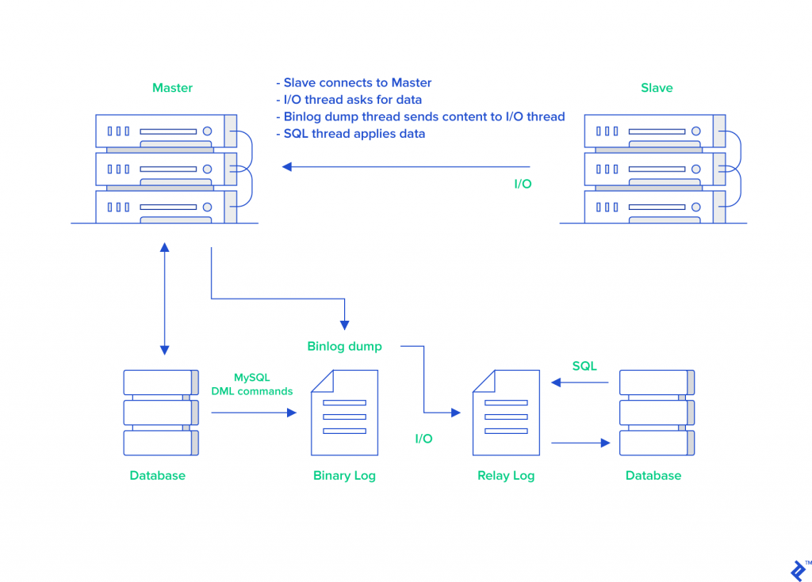
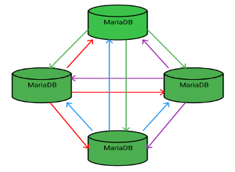

## **Question 1.** 
### a. Mariadb là gì?
"MariaDB Server is one of the most popular open source relational databases. It’s made by the original developers of MySQL and guaranteed to stay open source."
 
[Source: mariadb.org](https://mariadb.org/)

### b. Các mô hình database, cụ thể với mariadb: master-slave, galera.

### *Master-slave:*

### *Galera:*

Mỗi mô hình sẽ phù hợp cho một dạng service nhất định. Master - Slave phù hợp cho các service sử dụng nhiều các request Write do vấn đề đồng bộ thời gian thực sẽ được thực hiện đơn giản hơn - ngoài master, mỗi slave chỉ cần pool từ master là đủ. Trong khi đó, Galera sẽ phù hợp cho các service sử dụng nhiều request Read do việc đồng bộ sẽ phức tạp hơn - mỗi node sẽ cần pool từ tất cả các node còn lại và cần phản hồi thay đổi cho tất cả các node còn lại.

### c. Đưa ra kịch bản benchmark giữa 2 mô hình này

## **Question 2.**
### a. Database proxy là gì 
- Một cách hiểu đơn giản, database proxy hỗ trợ load balancing, reverse proxy... cho các DB instances.
### b. Các loại proxy trong DB (SQL-agnostic & SQL-aware) 
- SQL-agnostic: các loại DB proxy không được tối ưu dành riêng cho các DB instances
- SQL-aware: các loại DB đặc biệt cho các DB instances. VD: ProxySQL (MySQL), MaxScale (MariaDB)
### c. Cơ chế routing.
- SQL-agnostic: không có khả năng phân biệt được các loại query SQL => "Blindly distribute" các query đến các node.
- SQL-aware: quan tâm đến các loại query => Có thể phân phối cụ thể các dạng query đến một số node nhất định. 

## **Question 3.**
### a. Triển khai proxy cho từng mô hình
### b. Chiến lược routing và đưa ra kịch bản benchmark và tuning configurations:
### b.1. Kịch bản chạy bình thường
### b.2. Kịch bản khi db chết 1 node
**MASTER-SLAVE**
 
*Node master*:
 
*Node slave*:
 
**GALERA**

### b.3. Kịch bản khi db cluster bị split brain

**GALERA**

### b.4. Kịch bản khi 1 db proxy down

=> Database proxy cũng cần deploy dạng HA

## **Question 4.**
### Áp dụng cho OpenStack: đưa ra mô hình và chiến lược routing cho Openstack

## **Question 5.**
### Advance: tích hợp triển khai được maxscale cho kolla-ansible
